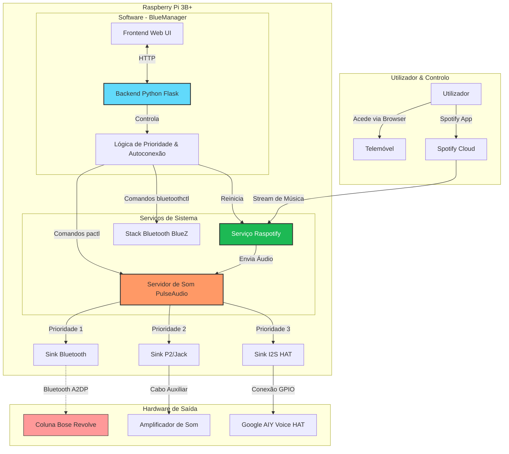

🎵 Jukebox Inteligente (Raspberry Pi + Spotify + Bluetooth Manager)

Este projeto transforma um Raspberry Pi numa central de áudio inteligente que prioriza automaticamente a saída de som (Bluetooth > Cabo P2 > HAT) e oferece uma interface Web (App) para gerir conexões Bluetooth facilmente.

📐 Arquitetura do Sistema

O diagrama abaixo ilustra como os componentes de Software e Hardware interagem para entregar o áudio na saída correta.

🛒 Hardware Utilizado

Placa: Raspberry Pi 3 Model B+ (ou Raspberry Pi 4)

Áudio 1: Caixa de Som Bluetooth (ex: Bose Revolve)

Áudio 2: Amplificador via Cabo P2 (Saída nativa)

Áudio 3: Google AIY Voice HAT (Opcional)

Sistema: Raspberry Pi OS Lite (64-bit)

🚀 Parte 1: Instalação do Sistema Operacional

Baixe e instale o Raspberry Pi Imager no seu computador.

Insira o cartão SD no PC.

Abra o Imager e configure:

OS Device: Raspberry Pi 3.

Operating System: Raspberry Pi OS (other) -> Raspberry Pi OS Lite (64-bit).

Nota: A versão "Lite" é crucial pois não tem interface gráfica, dedicando todo o processamento ao áudio.

Storage: Seu cartão SD.

⚙️ Configurações Avançadas (IMPORTANTE):

Clique em Next ou Ctrl+Shift+X.

Defina Hostname: jukebox.

Ative SSH (User: dambor ou seu nome, Senha: sua_senha).

Configure o Wi-Fi (SSID e Senha da sua rede).

Defina Locale settings (Timezone e Keyboard).

Clique em WRITE e aguarde.

Coloque o cartão no Raspberry Pi e ligue na tomada.

🎧 Parte 2: Configuração de Áudio e Bluetooth

Acesse o terminal via SSH: ssh dambor@jukebox.local

1. Instalar Pacotes de Áudio

O sistema Lite vem "pelado". Precisamos do PulseAudio para gerir o Bluetooth e o som.

sudo apt update
sudo apt install git python3-flask pulseaudio pulseaudio-module-bluetooth bluez-tools -y

2. Configurar o Hardware (HAT e Drivers)

Edite o arquivo de boot para ativar o HAT e melhorar o áudio:

sudo nano /boot/firmware/config.txt

Adicione/Verifique no final do arquivo:

[all]
# Ativa o driver do Google Voice HAT
dtoverlay=googlevoicehat-soundcard
# Melhora a qualidade do P2
audio_pwm_mode=2

3. Configurar o Bluetooth (Modo Compatibilidade)

Para garantir conexão com caixas modernas (Bose, JBL):

sudo nano /etc/bluetooth/main.conf

Adicione/Modifique estas seções:

[General]
# Força modo clássico (Áudio) em vez de Low Energy (Dados)
ControllerMode = bredr
Pairable = true
DiscoverableTimeout = 0
PairableTimeout = 0

[LE]
MinConnectionInterval=7
MaxConnectionInterval=9
ConnectionLatency=0

Reinicie o Bluetooth: sudo systemctl restart bluetooth

4. Permissões de Usuário

Adicione seu usuário aos grupos de áudio e bluetooth:

sudo usermod -a -G bluetooth,audio,pulse,pulse-access dambor

🎵 Parte 3: Spotify Connect (Raspotify)

Instale o cliente que faz o Pi aparecer no seu Spotify:

curl -sL [https://dtcooper.github.io/raspotify/install.sh](https://dtcooper.github.io/raspotify/install.sh) | sh

1. Configurar o Raspotify

sudo nano /etc/raspotify/conf

Conteúdo recomendado:

LIBRESPOT_NAME="Jukebox da Sala"
LIBRESPOT_BITRATE="320"
# Usa PulseAudio para permitir Bluetooth
LIBRESPOT_BACKEND="pulseaudio"
# NÃO defina LIBRESPOT_DEVICE, deixe automático

2. Corrigir Permissões do Serviço

O Raspotify roda isolado por padrão e não vê o Bluetooth do usuário. Vamos corrigir:

sudo nano /lib/systemd/system/raspotify.service

Na seção [Service], altere/adicione:

User=dambor
Group=dambor
DynamicUser=no
ProtectHome=false
PrivateUsers=false
Environment="PULSE_SERVER=unix:/run/user/1000/pulse/native"

(Nota: Substitua 1000 pelo seu UID se for diferente. Verifique com id -u dambor).

3. Permitir Reinício Automático (Sudoers)

Para que a nossa App possa reiniciar o Spotify sem pedir senha:

sudo visudo

Adicione no final:

dambor ALL=(ALL) NOPASSWD: /bin/systemctl restart raspotify

📱 Parte 4: BlueManager (A Web App)

Criamos uma aplicação em Python (Flask) para gerir tudo.

1. Estrutura de Pastas

mkdir -p ~/bluemanager/templates

2. O Backend (app.py)

Crie o arquivo ~/bluemanager/app.py.
(Este script contém a lógica de prioridade de áudio, conexão blindada Bluetooth e API web).

Nota: Use o código final Python fornecido na nossa conversa (que contém PRIORITY_3_HAT = "soc_sound" e a lógica audio_manager_loop).

3. O Frontend (templates/index.html)

Crie o arquivo ~/bluemanager/templates/index.html.
(Este arquivo contém a interface bonita com Tailwind CSS).

4. Criar o Serviço (Rodar no Boot)

Para a app iniciar sozinha ao ligar na tomada:

sudo nano /etc/systemd/system/bluemanager.service

Conteúdo:

[Unit]
Description=BlueManager Web App
After=network.target bluetooth.target pulseaudio.service

[Service]
User=dambor
WorkingDirectory=/home/dambor/bluemanager
ExecStart=/usr/bin/python3 app.py
Restart=always
Environment="PULSE_SERVER=unix:/run/user/1000/pulse/native"

[Install]
WantedBy=multi-user.target

5. Ativar Tudo

# Permite que serviços do usuário rodem sem login
sudo loginctl enable-linger dambor

# Inicia o PulseAudio
pulseaudio --start

# Ativa a App
sudo systemctl daemon-reload
sudo systemctl enable bluemanager.service
sudo systemctl start bluemanager.service

# Reinicia o Spotify
sudo systemctl restart raspotify

🎮 Como Usar

Conecte seu celular no mesmo Wi-Fi.

Abra o navegador e acesse: http://jukebox.local:5000

Para conectar Bluetooth:

Coloque a caixa em modo de pareamento.

Toque em "Escanear" na App.

Clique no dispositivo.

O sistema irá parear, conectar, configurar o áudio e reiniciar o Spotify automaticamente.

Prioridade Automática:

Se desligar o Bluetooth, o som volta para o Cabo P2 em ~5 segundos.

Se o Cabo falhar, tenta o HAT.

Parabéns! Projeto Concluído. 🎉